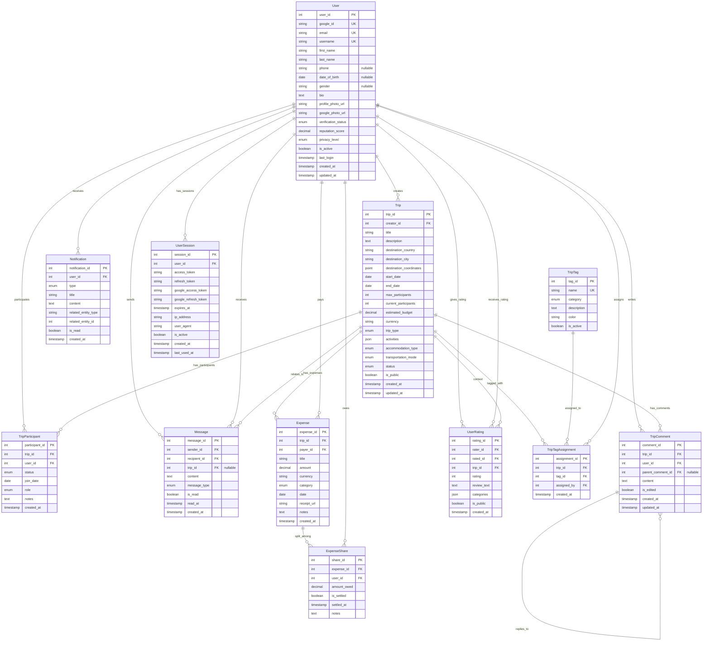

# JoinTrip - Entity Relationship Model

## Overview
This document describes the entity-relationship model for the JoinTrip application, a social travel platform that connects travelers, facilitates trip sharing, and manages shared expenses.

## Core Entities

### 1. User
**Purpose**: Represents registered users of the platform
**Key Attributes**:
- `user_id` (Primary Key): Unique identifier
- `google_id`: Google OAuth unique identifier
- `email`: User's email address from Google (unique)
- `username`: Display name (unique)
- `first_name`: User's first name from Google
- `last_name`: User's last name from Google
- `phone`: Contact phone number (optional)
- `date_of_birth`: User's birth date (optional)
- `gender`: User's gender (optional)
- `bio`: Personal description
- `profile_photo_url`: Profile image URL (from Google or custom)
- `google_photo_url`: Original Google profile photo
- `verification_status`: Identity verification status
- `reputation_score`: User rating based on reviews
- `privacy_level`: Profile visibility settings
- `is_active`: Account status
- `last_login`: Last login timestamp
- `created_at`: Registration timestamp
- `updated_at`: Last modification timestamp

**Annotations**:
- Users authenticate via Google OAuth 2.0
- Google ID ensures unique identification across the platform
- Email verification is handled by Google
- Profile photos can be sourced from Google or uploaded separately
- Verification status ensures trust between travelers
- Reputation score helps users choose reliable travel companions

### 2. Trip
**Purpose**: Represents travel opportunities posted by users
**Key Attributes**:
- `trip_id` (Primary Key): Unique identifier
- `creator_id` (Foreign Key): References User who created the trip
- `title`: Trip title/name
- `description`: Detailed trip description
- `destination_country`: Destination country
- `destination_city`: Destination city
- `destination_coordinates`: GPS coordinates for mapping
- `start_date`: Trip start date
- `end_date`: Trip end date
- `max_participants`: Maximum number of travelers
- `current_participants`: Current number of joined travelers
- `estimated_budget`: Estimated cost per person
- `currency`: Budget currency
- `trip_type`: Type of trip (adventure, cultural, business, etc.)
- `activities`: List of planned activities
- `accommodation_type`: Preferred accommodation
- `transportation_mode`: Primary transportation method
- `status`: Trip status (active, completed, canceled, full)
- `is_public`: Visibility setting
- `created_at`: Creation timestamp
- `updated_at`: Last modification timestamp

**Annotations**:
- Trips are the main content that drives user interactions
- Geographic data enables location-based search and mapping
- Budget information helps users find compatible financial arrangements

### 3. TripParticipant
**Purpose**: Junction entity managing user participation in trips
**Key Attributes**:
- `participant_id` (Primary Key): Unique identifier
- `trip_id` (Foreign Key): References Trip
- `user_id` (Foreign Key): References User
- `status`: Participation status (requested, approved, rejected, left)
- `join_date`: Date when user joined the trip
- `role`: Participant role (creator, co-organizer, participant)
- `notes`: Additional notes from organizer
- `created_at`: Request timestamp

**Annotations**:
- Manages the many-to-many relationship between Users and Trips
- Status tracking enables request/approval workflow
- Role system allows for trip management hierarchy

### 4. Message
**Purpose**: Handles direct communication between users
**Key Attributes**:
- `message_id` (Primary Key): Unique identifier
- `sender_id` (Foreign Key): References User who sent the message
- `recipient_id` (Foreign Key): References User who receives the message
- `trip_id` (Foreign Key, Optional): References Trip if message is trip-related
- `content`: Message text content
- `message_type`: Type (text, image, file, system)
- `is_read`: Read status
- `read_at`: Timestamp when message was read
- `created_at`: Message timestamp

**Annotations**:
- Enables private communication between potential travel companions
- Trip association helps organize trip-related conversations
- Read receipts improve communication transparency

### 5. TripComment
**Purpose**: Public comments on trip posts
**Key Attributes**:
- `comment_id` (Primary Key): Unique identifier
- `trip_id` (Foreign Key): References Trip
- `user_id` (Foreign Key): References User who commented
- `parent_comment_id` (Foreign Key, Optional): For threaded replies
- `content`: Comment text
- `is_edited`: Whether comment was modified
- `created_at`: Comment timestamp
- `updated_at`: Last edit timestamp

**Annotations**:
- Facilitates public discussion about trips
- Threaded structure supports conversation flow
- Edit tracking maintains transparency

### 6. Expense
**Purpose**: Tracks shared expenses during trips
**Key Attributes**:
- `expense_id` (Primary Key): Unique identifier
- `trip_id` (Foreign Key): References Trip
- `payer_id` (Foreign Key): References User who paid
- `title`: Expense description
- `amount`: Expense amount
- `currency`: Expense currency
- `category`: Expense category (food, transport, accommodation, etc.)
- `date`: Expense date
- `receipt_url`: Receipt image URL
- `notes`: Additional notes
- `created_at`: Record timestamp

**Annotations**:
- Central to the expense sharing functionality
- Categories help with expense analysis and reporting
- Receipt storage provides verification

### 7. ExpenseShare
**Purpose**: Defines how expenses are split among participants
**Key Attributes**:
- `share_id` (Primary Key): Unique identifier
- `expense_id` (Foreign Key): References Expense
- `user_id` (Foreign Key): References User who owes
- `amount_owed`: Amount this user owes
- `is_settled`: Whether user has paid their share
- `settled_at`: Settlement timestamp
- `notes`: Settlement notes

**Annotations**:
- Enables flexible expense splitting (equal, custom amounts)
- Settlement tracking manages payment status
- Supports complex expense sharing scenarios

### 8. UserRating
**Purpose**: User reviews and ratings system
**Key Attributes**:
- `rating_id` (Primary Key): Unique identifier
- `rater_id` (Foreign Key): References User giving the rating
- `rated_id` (Foreign Key): References User being rated
- `trip_id` (Foreign Key): References Trip context
- `rating`: Numeric rating (1-5)
- `review_text`: Written review
- `categories`: Rating categories (reliability, communication, etc.)
- `is_public`: Review visibility
- `created_at`: Rating timestamp

**Annotations**:
- Builds trust through peer reviews
- Trip context provides specific feedback
- Category ratings offer detailed insights

### 9. Notification
**Purpose**: System notifications for users
**Key Attributes**:
- `notification_id` (Primary Key): Unique identifier
- `user_id` (Foreign Key): References User receiving notification
- `type`: Notification type (trip_request, message, expense, etc.)
- `title`: Notification title
- `content`: Notification content
- `related_entity_type`: Type of related entity (trip, user, expense)
- `related_entity_id`: ID of related entity
- `is_read`: Read status
- `created_at`: Notification timestamp

**Annotations**:
- Keeps users informed of platform activities
- Generic design supports various notification types
- Related entity links enable direct navigation

### 10. TripTag
**Purpose**: Categorization tags for trips
**Key Attributes**:
- `tag_id` (Primary Key): Unique identifier
- `name`: Tag name
- `category`: Tag category (activity, style, budget, etc.)
- `description`: Tag description
- `color`: Display color
- `is_active`: Tag availability status

**Annotations**:
- Improves trip discoverability through categorization
- Categories organize tags logically
- Visual elements enhance user experience

### 11. TripTagAssignment
**Purpose**: Junction entity for trip-tag relationships
**Key Attributes**:
- `assignment_id` (Primary Key): Unique identifier
- `trip_id` (Foreign Key): References Trip
- `tag_id` (Foreign Key): References TripTag
- `assigned_by` (Foreign Key): References User who assigned tag
- `created_at`: Assignment timestamp

**Annotations**:
- Manages many-to-many relationship between trips and tags
- Attribution tracking for tag assignments
- Enables tag-based search and filtering

### 12. UserSession
**Purpose**: Manages user authentication sessions and OAuth tokens
**Key Attributes**:
- `session_id` (Primary Key): Unique identifier
- `user_id` (Foreign Key): References User
- `access_token`: JWT access token
- `refresh_token`: OAuth refresh token (encrypted)
- `google_access_token`: Google OAuth access token (encrypted)
- `google_refresh_token`: Google OAuth refresh token (encrypted)
- `expires_at`: Token expiration timestamp
- `ip_address`: Client IP address
- `user_agent`: Client user agent
- `is_active`: Session status
- `created_at`: Session creation timestamp
- `last_used_at`: Last activity timestamp

**Annotations**:
- Manages OAuth 2.0 token lifecycle
- Stores encrypted Google tokens for API access
- Tracks session security information
- Enables session management and revocation
- Supports multiple active sessions per user

## Visual Entity Relationship Diagram

## Entity Relationships

### Primary Relationships

1. **User → Trip** (One-to-Many)
   - One user can create multiple trips
   - Each trip has exactly one creator

2. **User ↔ Trip** (Many-to-Many via TripParticipant)
   - Users can participate in multiple trips
   - Trips can have multiple participants

3. **User → Message** (One-to-Many as Sender)
   - One user can send multiple messages
   - Each message has exactly one sender

4. **User → Message** (One-to-Many as Recipient)
   - One user can receive multiple messages
   - Each message has exactly one recipient

5. **Trip → TripComment** (One-to-Many)
   - One trip can have multiple comments
   - Each comment belongs to exactly one trip

6. **User → TripComment** (One-to-Many)
   - One user can make multiple comments
   - Each comment is made by exactly one user

7. **Trip → Expense** (One-to-Many)
   - One trip can have multiple expenses
   - Each expense belongs to exactly one trip

8. **User → Expense** (One-to-Many as Payer)
   - One user can pay for multiple expenses
   - Each expense has exactly one payer

9. **Expense ↔ User** (Many-to-Many via ExpenseShare)
   - One expense can be shared among multiple users
   - One user can owe on multiple expenses

10. **User ↔ User** (Many-to-Many via UserRating)
    - Users can rate multiple other users
    - Users can be rated by multiple other users

11. **Trip ↔ TripTag** (Many-to-Many via TripTagAssignment)
    - One trip can have multiple tags
    - One tag can be assigned to multiple trips

12. **User → UserSession** (One-to-Many)
    - One user can have multiple active sessions
    - Each session belongs to exactly one user

### Secondary Relationships

- **TripComment → TripComment** (Self-referencing for threaded replies)
- **Message → Trip** (Optional association for trip-related messages)
- **UserRating → Trip** (Rating context)
- **Notification → Various Entities** (Generic relationship via entity type/ID)

## Business Rules and Constraints

### User Constraints
- Google IDs must be unique across the platform
- Email addresses must be unique across the platform
- Users authenticate only through Google OAuth 2.0
- Users must be verified to create trips
- Minimum age requirement (18 years)
- Users cannot rate themselves

### Authentication Constraints
- Sessions must have valid JWT tokens
- Google tokens must be encrypted at rest
- Session expiration must be enforced
- Maximum number of active sessions per user (configurable)
- IP address and user agent tracking for security

### Trip Constraints
- Trip end date must be after start date
- Current participants cannot exceed max participants
- Only trip creators can modify trip details
- Trips cannot be deleted if they have participants

### Expense Constraints
- Expense amounts must be positive
- Total expense shares must equal the expense amount
- Only trip participants can be included in expense shares
- Expenses can only be added by trip participants

### Rating Constraints
- Users can only rate others they've traveled with
- One rating per user per trip
- Ratings must be between 1 and 5
- Users cannot modify ratings after 30 days

### Communication Constraints
- Users can only message other users they share trips with
- Blocked users cannot send messages
- System messages cannot be deleted by users

## Data Integrity Considerations

1. **Referential Integrity**: All foreign key relationships must be maintained
2. **Cascade Deletes**: User deletion should handle dependent records appropriately
3. **Soft Deletes**: Important entities should use soft deletion for data preservation
4. **Audit Trail**: Critical operations should maintain audit logs
5. **Data Validation**: All inputs must be validated at application and database levels

## Performance Considerations

1. **Indexing Strategy**:
   - Primary keys and foreign keys
   - Email and username for user lookups
   - Trip destination and dates for search
   - Message timestamps for conversation ordering

2. **Query Optimization**:
   - Trip search queries with multiple filters
   - User reputation calculations
   - Expense balance calculations
   - Notification retrieval

3. **Caching Strategy**:
   - User profile data
   - Trip search results
   - Popular destinations and tags
   - Currency exchange rates

This entity-relationship model provides a comprehensive foundation for the JoinTrip application, supporting all planned features while maintaining data integrity and performance.
